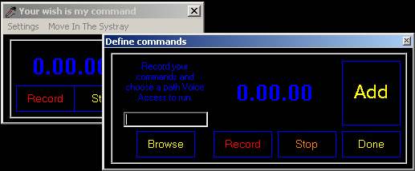

## Voice Applications Access System

### Description

It allows you to record default commands for any applications and to access them by only repeating the command. NO external Microsoft enigines, all pure code. It's very handy and easy to use: it moves in the systray, waiting for your command. Just record easy-to-remember commands and just with your voice you can run any application. Talk to your computer. Please write your comments. Tyler says: The Importance of Being Idle.
 
### More Info
 

             |
---                |---
**Submitted On**   |2005-11-03 19:39:08
**By**             |[Licar Bogdan](https://github.com/Planet-Source-Code/PSCIndex/blob/master/ByAuthor/licar-bogdan.md)
**Level**          |Intermediate
**User Rating**    |4.0 (12 globes from 3 users)
**Compatibility**  |VB 5\.0, VB 6\.0
**Category**       |[Sound/MP3](https://github.com/Planet-Source-Code/PSCIndex/blob/master/ByCategory/sound-mp3__1-45.md)
**World**          |[Visual Basic](https://github.com/Planet-Source-Code/PSCIndex/blob/master/ByWorld/visual-basic.md)
**Archive File**   |[Voice\_Appl1946061142005\.zip](https://github.com/Planet-Source-Code/licar-bogdan-voice-applications-access-system__1-63157/archive/master.zip)

